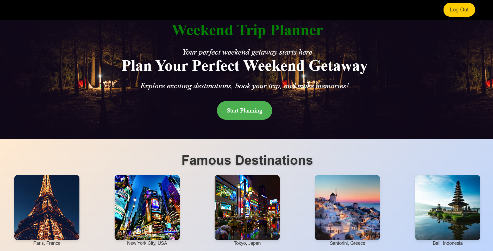
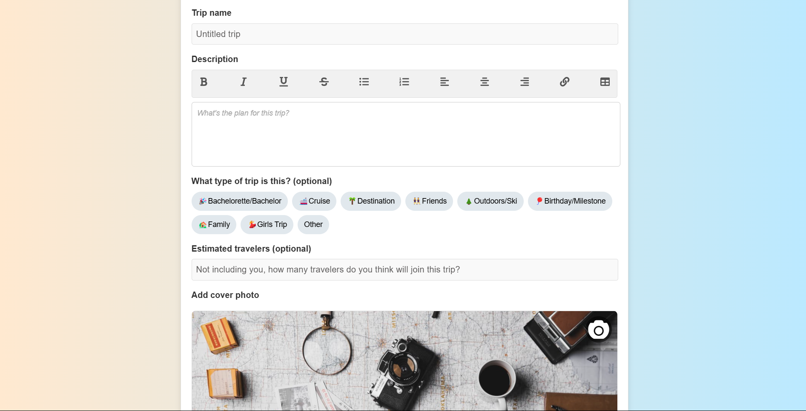
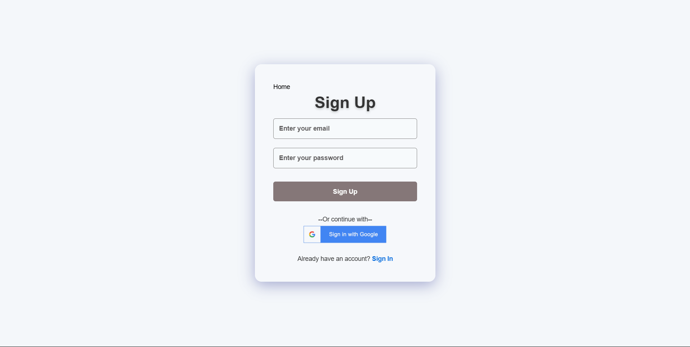

# Code_Compass_019

Project Name - Go Weekend

## Introduction
This is an application that addresses the common challenges faced when planning weekends with friends. This app makes the process easier by providing features that help with scheduling, finding activities, and managing logistics.

Team : 
1) Manohar Varma - manoharv2512
2) Mahesh Tidgam - maheshtidgam
3) Manoj Rawat - manojRawat5
4) Shashank Sinha - i-am-shank

## Directory Structure
./  
├─ public/  
├─ src/  
&nbsp; &nbsp; ├─ components/  
&nbsp; &nbsp; &nbsp; &nbsp; ├─ auth/  
&nbsp; &nbsp; &nbsp; &nbsp; &nbsp; &nbsp; ├─ Signin.jsx  
&nbsp; &nbsp; &nbsp; &nbsp; &nbsp; &nbsp; ├─ Signup.jsx  
&nbsp; &nbsp; &nbsp; &nbsp; &nbsp; &nbsp; ├─ SigninWithGoogle.jsx  
&nbsp; &nbsp; &nbsp; &nbsp; &nbsp; &nbsp; ├─ firebase.js  
&nbsp; &nbsp; &nbsp; &nbsp; ├─ home/  
&nbsp; &nbsp; &nbsp; &nbsp; &nbsp; &nbsp; ├─ Home.jsx  
&nbsp; &nbsp; &nbsp; &nbsp; ├─ tripPlan/  
&nbsp; &nbsp; &nbsp; &nbsp; &nbsp; &nbsp; ├─ ChooseCab.jsx  
&nbsp; &nbsp; &nbsp; &nbsp; &nbsp; &nbsp; ├─ ChooseHotel.jsx  
&nbsp; &nbsp; &nbsp; &nbsp; &nbsp; &nbsp; ├─ ChooseLocation.jsx  
&nbsp; &nbsp; &nbsp; &nbsp; &nbsp; &nbsp; ├─ TripPlan.jsx  
&nbsp; &nbsp; &nbsp; &nbsp; ├─ Article1.jsx  
&nbsp; &nbsp; &nbsp; &nbsp; ├─ DatesPage.jsx  
&nbsp; &nbsp; &nbsp; &nbsp; ├─ TripDiscription.jsx  
&nbsp; &nbsp; ├─ pages/  
&nbsp; &nbsp; &nbsp; &nbsp; ├─ LandingPage.jsx  
&nbsp; &nbsp; &nbsp; &nbsp; ├─ MainDatePage.jsx  
&nbsp; &nbsp; &nbsp; &nbsp; ├─ TripPage.jsx  
&nbsp; &nbsp; ├─ utils/  
&nbsp; &nbsp; &nbsp; &nbsp; ├─ homePage-poster.jpg  
&nbsp; &nbsp; ├─ App.jsx  
&nbsp; &nbsp; ├─ main.jsx  
index.html  
package.json  

## Video Walkthrough of the project
https://youtu.be/rWzSINlJxbc 

# Getting Started

1. Clone the repository to your local machine:
   - git clone https://github.com/manoharv2512/Code_Compass_019.git 
   - Run the command "cd GoWeekend-app".
2. Run the command "npm install" in the terminal, at the current location.
3. Run "npm run dev" to run the project.

## Technology Stack
- React JS
- JavaScript
- CSS
- Firebase
- Tailwind CSS
